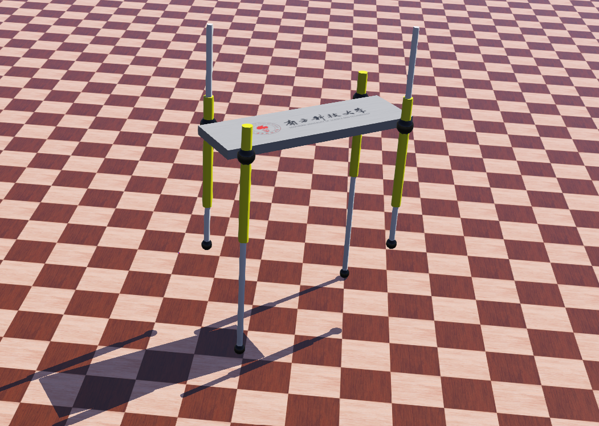
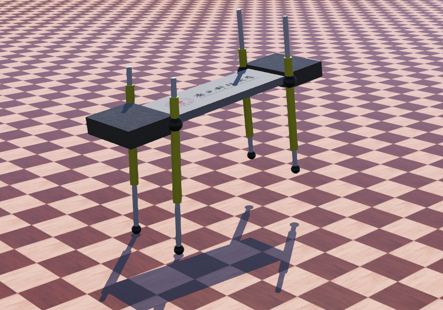

# Quadraped-running-machine
A quadruped running machine in webots, planned to simulate three different gaits: trotting, pacing, and bounding.
## Instructions
### 1. Trouting
Open _Quadruped-running.wbt_ in Webots

Open _trot.c_ file from the controller directory in the webots editor. Don't forget to **clean** and  **make**.

Control the robot with the four arrow keys, where **"↑"** or **"↓"** means forward and backward, **"←"** or **"→"** means turning left or right.

### 2. Bounding
Open _Quadruped-running-bound.wbt_ in Webots

Open _bound.c_ file from the controller directory in the webots editor. Don't forget to **clean** and  **make**.

Watch our robot bound for several times.

## In the process
* We've just done the **"troting"** gait. Now working on **"pacing"** and **"bounding"**.

* Some error will show up in the consle during running but it usually dose not affect the robot.

* The current **bounding** gait is unstable although we've done almost everything mentioned in the article. It could be a problem caused by the differences between the _air pump_ in the article and the _linear motor_ that we use to simulate the properties.

* The method of estimating velocity _"update-xz-dot()"_ might be inaccurate in **bounding**.
## Reference
* We started our project referencing an existed [one-legged-hopping-machine project](https://github.com/YuXianYuan/Hopping-in-Three-Dimensions)

* We're also motivatied by Raiber's work back to the 1980s. Articles can be found in our reference dirctory.
